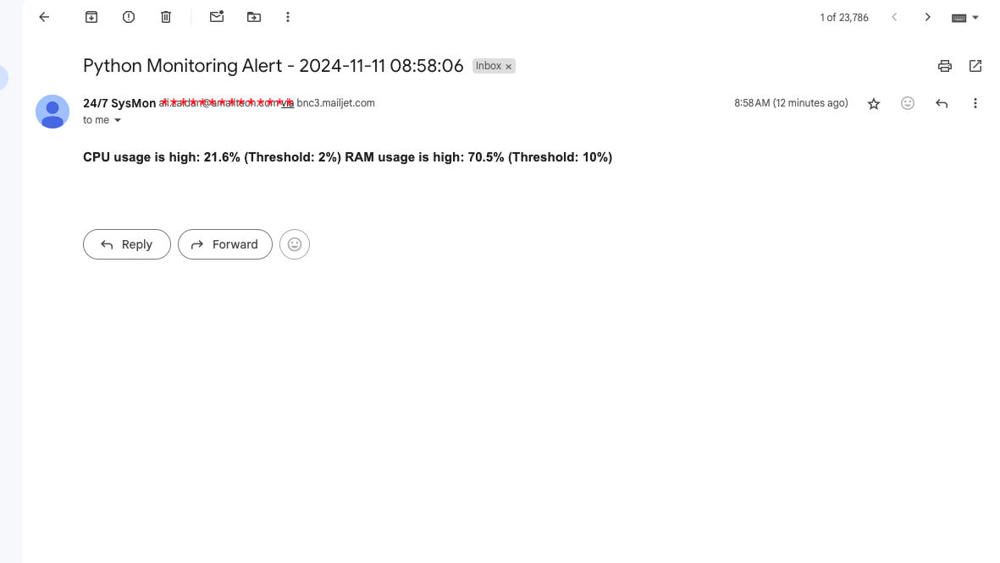

# System Monitoring Lab 🖥️

A Python-based system monitoring solution that tracks CPU, RAM, and Disk usage metrics and sends email alerts when thresholds are exceeded.

## Features

- Real-time monitoring of system resources
- Customizable alert thresholds
- Automated email notifications via Mailjet
- Low resource footprint
- Easy to configure and deploy

## Prerequisites

- Python 3.6+
- Mailjet account
- Linux/Unix/Windows system with admin privileges

## Installation

1. Clone this repository:
```bash
git clone https://github.com/zaidanali028/system-monitoring-lab.git
cd system-monitoring-lab
```

2. Create and activate virtual environment:
```bash
python -m venv venv
source venv/bin/activate  # Linux/Mac
.\venv\Scripts\activate   # Windows
```

3. Install required packages:
```bash
pip install psutil mailjet_rest 
```

## Configuration

1. Add  `environment-variables` to your systems' environment :
```plaintext
MAIL_JET_API_KEY=your_api_key_here
MAIL_JET_API_SECRET=your_api_secret_here
SYSTEM_EMAIL=your_sender_email@domain.com
ADMIN_EMAIL=admin_recipient@domain.com
```

2. Adjust monitoring thresholds in `monitor.py` by updating the following variables:
```python
CPU_THRESHOLD = 80  # CPU usage percentage
RAM_THRESHOLD = 85  # RAM usage percentage
DISK_THRESHOLD = 90 # Disk usage percentage
```

## Usage

Run the monitoring script:
```bash
python monitor.py
```

For continuous monitoring, set up a cron job (Linux/Mac) or Task Scheduler (Windows).

### Example Cron Entry (Every 5 minutes)
```bash
*/5 * * * * /path/to/venv/bin/python /path/to/monitor.py
```

## Sample Alert Email

Below is an example of the system monitoring alert email:




## Alert Triggers

The script sends alerts when:
- CPU usage exceeds configured threshold
- RAM usage exceeds configured threshold
- Available disk space falls below threshold
- Any monitored service becomes unresponsive

## Troubleshooting

### Common Issues

1. **No Alerts Received**
   - Verify Mailjet credentials
   - Check spam folder
   - Confirm threshold settings
   - Verify internet connectivity

2. **Script Errors**
   - Ensure all environment variables are set
   - Verify Python version compatibility
   - Check system permissions

3. **High Resource Usage**
   - Adjust monitoring interval
   - Review threshold settings
   - Check for competing processes

## Contributing

1. Fork the repository
2. Create your feature branch
3. Commit your changes
4. Push to the branch
5. Create a Pull Request

## License

This project is licensed under the MIT License - see the [MIT](LICENSE) file for details.

## Acknowledgments

- Mailjet for email API services
- Python psutil developers
- Open source community

## Support

For support, please open an issue in the repository or contact the maintainer at zaidanali028@gmail.com.
